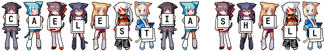

<div align="center">



<p align="center">
  <b>A desktop shell fork for Linux with native video wallpapers, Material Shape transitions, and directory categorization.</b><br>
  <i>Based on <a href="https://github.com/caelestia-dots/shell">Caelestia Shell</a></i>
</p>

[](https://github.com/AxZoRos/anima-shell/releases)
[](https://github.com/AxZoRos/anima-shell/commits/main)
[](https://github.com/AxZoRos/anima-shell/stargazers)
[](LICENSE)

<br>

<!-- Video demonstration placeholder -->
<!-- <video src="https://github.com/user-attachments/assets/YOUR_VIDEO_ID" controls width="100%"></video> -->
<p><i>🎬 Demo video coming soon</i></p>

</div>

---

## Overview

Anima Shell is a modified distribution of Caelestia Shell designed to extend the wallpaper system with native video playback, subfolder categorization, and adaptive resource management:

* **Video Wallpapers**: Hardware-accelerated video rendering via QtMultimedia with configurable decoder backends (VA-API, NVDEC, CPU).
* **Directory Categorization**: Recursive folder parsing that treats subdirectories in `~/Pictures/Wallpapers` as distinct categories with category memory.
* **Playback Management**: Automatic pausing of wallpaper playback during fullscreen windows, battery power, or lockscreen states.
* **Material Shape Transitions**: Geometric shape morphing and cross-fading when navigating between backgrounds.
* **Metadata Badges**: Direct display of codec, framerate, and bitrate information on launcher wallpaper items.
* **Deployment & Safety**: Interactive installer with multi-distro dependency resolution, automated transactional rollback, and stock Caelestia restore capabilities.

---

## Installation

Anima Shell runs on top of the Caelestia ecosystem and Quickshell. Ensure your system meets the base Caelestia requirements before deploying.

### Option A: One-Line Automatic Install (Recommended)

Run the remote installer directly in your terminal:

```bash
curl -fsSL https://raw.githubusercontent.com/AxZoRos/anima-shell/main/install.sh | bash
```

### Option B: Local Git Clone Install

Clone the repository locally and run the installer:

```bash
git clone https://github.com/AxZoRos/anima-shell.git
cd anima-shell
./install.sh
```

The installer verifies system dependencies, compiles the C++ plugin, deploys QML modules to `/etc/xdg/quickshell/caelestia`, and patches the Python CLI for hardware video decoder injection.

---

## Updating

You can update Anima Shell at any time using either method:

### Option A: Remote Update

Run the installer script and select **`[2] Update Anima Shell`**:

```bash
curl -fsSL https://raw.githubusercontent.com/AxZoRos/anima-shell/main/install.sh | bash
```

### Option B: Local Repository Update

Pull the latest commits and launch the installer:

```bash
cd ~/anima-shell   # or your clone path
git pull
./install.sh
```

Select **`[2] Update Anima Shell`** in the interactive menu. The installer will safely recompile the C++ plugin, deploy updated QML modules, and restart the shell with zero configuration loss.

---

## Launcher Shortcuts

The following keybindings are available when the wallpaper launcher is open:

| Keybinding | Action |
| :--- | :--- |
| `Ctrl + B` | Cycle / toggle metadata badges mode |
| `Ctrl + R` | Select a random wallpaper from the current category |
| `Ctrl + Tab` | Cycle filter mode forward (`All` → `Static` → `Animated`) |
| `Ctrl + Shift + Tab` | Cycle filter mode backward |
| `Alt + Left` / `Alt + H` | Switch to the previous category |
| `Alt + Right` / `Alt + L` | Switch to the next category |
| `Alt + 1` .. `Alt + 9` | Jump to the N-th category |

---

## Modified & Added Files

Overview of code modifications relative to upstream Caelestia Shell:

| File | Type | Description |
| :--- | :--- | :--- |
| `install.sh` | `NEW` | Interactive deployment script with transactional rollback and backup management. |
| `modules/background/VideoWallpaper.qml` | `NEW` | QtMultimedia video playback component with frame freezing and destruction cleanup. |
| `modules/background/Wallpaper.qml` | `MODIFIED` | Dual-buffer layer management with Material Shape transition shaders. |
| `modules/launcher/Content.qml` | `MODIFIED` | Category tabs, action controls, and navigation keybindings. |
| `modules/launcher/WallpaperList.qml` | `MODIFIED` | PathView scroll velocity debounce and settling delay tuning. |
| `modules/launcher/items/WallpaperItem.qml` | `MODIFIED` | Wallpaper card component with interactive format, FPS, and bitrate badges. |
| `modules/nexus/common/WallItem.qml` | `MODIFIED` | Grid item view with responsive metadata display. |
| `modules/nexus/pages/WallpaperAndStyle.qml` | `MODIFIED` | Settings interface for playback pause rules and hardware decoder selection. |
| `modules/nexus/pages/wallandstyle/WallpaperCategory.qml` | `MODIFIED` | Category browser navigation view in Nexus. |
| `modules/nexus/pages/wallandstyle/WallpaperSelect.qml` | `MODIFIED` | Grid selection view with category filtering and persistent memory. |
| `plugin/src/Caelestia/Models/filesystemmodel.cpp` | `MODIFIED` | C++ recursive directory scanner fixes and deduplication locks. |
| `services/Colours.qml` | `MODIFIED` | Material You palette extraction synchronized with video frames. |
| `services/WallpaperPauser.qml` | `NEW` | Workspace occlusion and power status monitoring for playback pause control. |
| `services/Wallpapers.qml` | `MODIFIED` | Core wallpaper service with format detection, metadata caching, and state management. |
| `services/WallpaperThumbQueue.qml` | `NEW` | Multi-threaded asynchronous video thumbnailing and metadata extraction queue. |

---

## Credits & Acknowledgements

Anima Shell builds upon and adapts ideas from the open-source community:

* **[caelestia-dots/shell](https://github.com/caelestia-dots/shell)** — Upstream desktop shell architecture.
* **[7nik/booru-clock](https://github.com/7nik/booru-clock)** — Pixel art character sprites and split-flap mechanical flip clock inspiration for the animated banner.
* **[adiambassador/caelestia-aw](https://github.com/adiambassador/caelestia-aw)** — Initial concept for animated wallpaper integration in Caelestia.
* **[SunnydeuS/Caelestia-Live-Wallpapers-Integration](https://github.com/SunnydeuS/Caelestia-Live-Wallpapers-Integration)** — Concept for metadata badges on thumbnail cards.
* **[dim-ghub/midnight-shell](https://github.com/dim-ghub/midnight-shell)** — Implementation reference for Material Shape transition masks.

*Development note: Designed and implemented with AI pair-programming assistance.*

---

## Documentation

For general documentation on upstream Caelestia widgets, IPC commands, and global compositor bindings, consult the official repository:
👉 **[caelestia-dots/shell](https://github.com/caelestia-dots/shell)**
